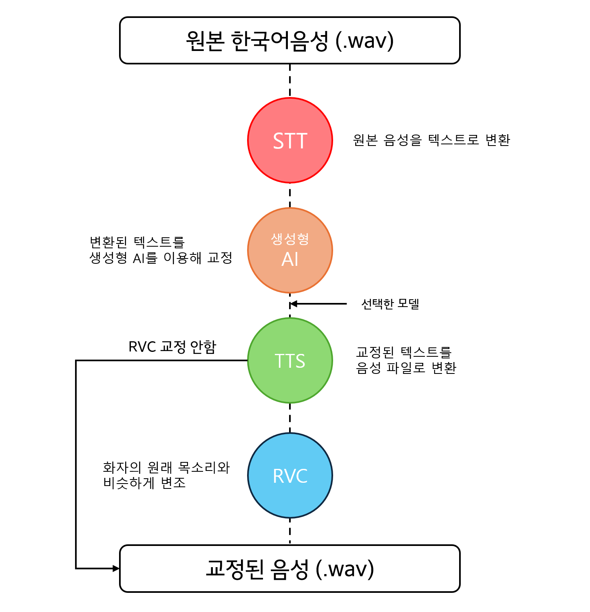

# Speech Correction 데모 서비스

> **생성형AI 및 RVC 기반 음성 교정 SW**의 API 서버를 이용해보기 위한 데모 서비스 입니다.

## 실행 방법

> 실행 전 [Node.js](https://nodejs.org/) 설치가 필요합니다.

프로젝트의 `demoservice` 폴더로 이동합니다.

```shell
cd demoservice
```

다음 명령어를 실행하여, 필요한 패키지를 다운받습니다.

```shell
npm install
```

프로젝트의 `demoservice` 폴더의 `.env` 파일에 다음과 같이 API 호출 URL를 설정합니다.

```
REACT_APP_API_URL = http://127.0.0.1:8000/speech-correction (speech-correction API 호출 URL)
REACT_APP_LOG_URL = http://127.0.0.1:8000/log (speech-correction API 로그 호출 URL)
```

다음 명령어를 실행하여, 데모 서비스를 시작합니다.

```shell
npm start
```

---

